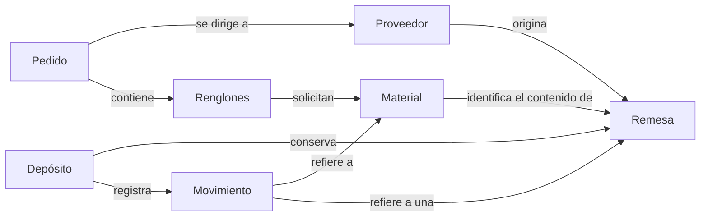
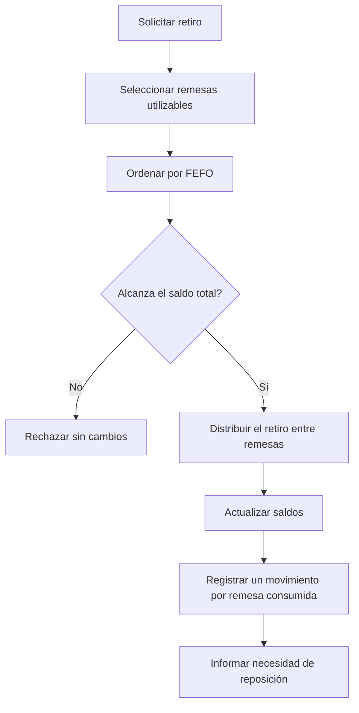

# Trabajo Práctico: Sistema de Inventario JIT con Trazabilidad

## Situación Hipotética

**AeroTech Components** abastece líneas de producción con materiales recibidos en remesas identificables. Hoy registra ingresos y retiros en planillas separadas: no puede reconstruir con certeza qué remesas se consumieron, suele detectar tarde los faltantes y, en ocasiones, considera disponible material vencido.

La empresa solicita el núcleo de un inventario *Just-In-Time* (JIT). El sistema deberá conocer las existencias utilizables en una fecha, retirar material según una política explícita, conservar la trazabilidad de cada movimiento y advertir cuándo corresponde reponer. No deberá emitir pedidos automáticamente ni decidir cuánto comprar.

### Objetivo del sistema

El prototipo deberá permitir:

- registrar materiales, proveedores y remesas;
- consultar existencias físicas y disponibles en una fecha;
- retirar material aplicando FEFO sin dejar consumos parciales ante un error;
- reconstruir los movimientos de un material y de una remesa;
- detectar materiales por debajo de su punto de reposición;
- confeccionar pedidos y calcular su valor total.

### Alcance y vocabulario del dominio

| Concepto | Representa | Es responsable de | No es responsable de |
| --- | --- | --- | --- |
| Material | Un tipo de insumo medido en una unidad | Identidad, unidad y punto de reposición | Elegir remesas durante un retiro |
| Proveedor | Una fuente de abastecimiento | Identidad y plazo estimado de entrega | Administrar existencias |
| Remesa | Una partida recibida de un material | Cantidad recibida, saldo, origen, recepción y vencimiento | Decidir por sí sola el orden de consumo global |
| Depósito | El inventario central del prototipo | Registrar remesas y coordinar consultas y retiros | Emitir pedidos automáticamente |
| Movimiento | Un hecho trazable de ingreso o retiro | Fecha, tipo, material, remesa y cantidad | Cambiar luego de ser registrado |
| Pedido | Una solicitud todavía no recibida | Proveedor, fecha, renglones y valor total | Aumentar existencias antes de la recepción |
| Renglón de pedido | Una cantidad y precio acordado para un material | Calcular su subtotal | Elegir proveedor o modificar inventario |

El mapa expresa relaciones del negocio, no clases, colecciones ni navegabilidad obligatorias.

### Flujo de retiro FEFO

Para una fecha de operación, se consideran utilizables las remesas con saldo positivo que todavía no vencieron. Se ordenan primero las que tienen vencimiento, por fecha de vencimiento ascendente; en un empate, por fecha de recepción y luego por identificador. Las remesas sin vencimiento se consumen después, por fecha de recepción y luego por identificador.

### Ejemplo de aceptación

El material `AL-7`, medido en kilogramos, tiene punto de reposición `10`. Al 10/08/2026 existen tres remesas: `R1`, recibida el 01/08, saldo `5` y vencimiento 20/08; `R2`, recibida el 03/08, saldo `8` y vencimiento 15/08; y `R3`, recibida el 02/08, saldo `4` y sin vencimiento.

Un retiro de `10 kg` debe consumir primero los `8 kg` de `R2` y luego `2 kg` de `R1`. Los saldos quedan `R1 = 3`, `R2 = 0` y `R3 = 4`; se registran dos movimientos de salida y la existencia disponible queda en `7 kg`. Como `7 < 10`, la consulta de reposición incluye `AL-7`. Un retiro posterior de `8 kg` se rechaza sin alterar esos saldos ni agregar movimientos.

### Fuera de alcance

No se requiere interfaz gráfica, persistencia, múltiples depósitos, monedas o impuestos, reservas de stock, devoluciones, cuarentena de calidad, integración con proveedores ni pronóstico de demanda. El sistema no genera pedidos ni define cantidades de compra automáticamente.

## Requerimientos Técnicos Obligatorios

- Implementar la solución con Programación Orientada a Objetos y separar el punto de entrada de la lógica del dominio.
- Identificar y justificar una jerarquía de herencia que represente una especialización real dentro del dominio y una variación polimórfica de comportamiento, por ejemplo entre políticas de consumo. No alcanza con crear subtipos sin comportamiento diferente.
- Mantener encapsulados los saldos y el historial: no podrán corregirse mediante modificación directa de atributos.
- Implementar el ordenamiento y la distribución FEFO con estructuras nativas, sin delegarlos a una librería de inventario.
- Definir excepciones propias para datos inválidos, duplicados, remesas no utilizables y existencias insuficientes. No se aceptan `Exception` genéricas ni `print` como único manejo.
- Utilizar `date` o `datetime` de la biblioteca estándar y una representación numérica consistente para cantidades y precios.
- Escribir pruebas unitarias con `pytest` para cálculos, prioridades, límites, atomicidad y trazabilidad.

## Reglas de Negocio

1. **Identidad y datos obligatorios:** Los identificadores de materiales, proveedores y remesas son únicos dentro de su categoría y no pueden estar vacíos. Cada material tiene nombre y unidad no vacíos; cada remesa refiere a un material y a un proveedor ya registrados.
2. **Cantidades y valores:** La cantidad recibida, las cantidades retiradas, los renglones de pedido y los precios unitarios son positivos. El saldo de una remesa nunca puede ser negativo. El punto de reposición es mayor o igual que cero y el plazo estimado de un proveedor es una cantidad entera no negativa de días.
3. **Fechas de una remesa:** La recepción no puede ocurrir después de la fecha de operación en la que se registra. Si existe vencimiento, debe ser estrictamente posterior a la recepción. Una remesa está vencida en una fecha cuando `fecha_consultada >= fecha_vencimiento`.
4. **Ingreso trazable:** Registrar una remesa crea exactamente un movimiento de ingreso por su cantidad total. Ni la remesa ni ese movimiento pueden duplicarse si falla alguna validación.
5. **Existencias consultables:** La existencia física de un material es la suma de los saldos de todas sus remesas. La existencia disponible en una fecha suma solo remesas recibidas, con saldo positivo y no vencidas en esa fecha. Consultar existencias no modifica saldos ni historial.
6. **Prioridad FEFO:** Para retirar se consumen primero las remesas con vencimiento más próximo; los empates se resuelven por recepción más antigua y luego por identificador ascendente. Las remesas sin vencimiento se consumen después, también por recepción e identificador.
7. **Retiro distribuido:** Un retiro puede consumir una o varias remesas y registra un movimiento de salida por cada remesa afectada, con la cantidad efectivamente descontada. La suma de esos movimientos debe coincidir con la cantidad solicitada.
8. **Atomicidad ante faltantes:** Si la existencia disponible es menor que la solicitada, el retiro completo se rechaza con una excepción de existencias insuficientes. Ningún saldo ni movimiento cambia, aunque alguna remesa por sí sola tuviera saldo.
9. **Reposición:** Un material requiere reposición cuando su existencia disponible en la fecha consultada es estrictamente menor que su punto de reposición. Alcanzar exactamente el punto no dispara la advertencia. La consulta no crea pedidos.
10. **Pedidos:** Un pedido pertenece a un único proveedor, tiene fecha de emisión y al menos un renglón. Un material aparece una sola vez por pedido. Su total es la suma de `cantidad * precio_unitario` de todos los renglones y su creación no altera existencias.
11. **Historial inmutable:** Todo movimiento conserva identificador único, tipo `INGRESO` o `RETIRO`, fecha de operación, material, remesa y cantidad positiva. Una vez registrado no puede modificarse ni eliminarse mediante operaciones normales del dominio.
12. **Trazabilidad:** El historial de una remesa devuelve su ingreso y sus retiros en orden cronológico, desempata por identificador y permite calcular `cantidad_ingresada - retiros = saldo_actual`. El historial de un material reúne los movimientos de todas sus remesas sin alterar el inventario.

### Pruebas mínimas esperadas

- identificadores vacíos o duplicados y cantidades no positivas;
- vencimiento igual, anterior y posterior a la fecha consultada;
- diferencia entre existencia física y disponible;
- FEFO con vencimientos distintos, empates y remesas sin vencimiento;
- retiro que abarca varias remesas y movimientos resultantes;
- faltante rechazado sin cambios parciales;
- reposición justo en el punto y por debajo de él;
- total de un pedido y material repetido;
- reconstrucción del saldo desde el historial;
- consultas sin efectos secundarios.

### Decisiones de diseño que deberán resolver

- ¿Qué objeto coordina un retiro que afecta varias remesas?
- ¿Cómo se representa el criterio FEFO para poder sustituirlo sin repartir condicionales por el modelo?
- ¿El saldo se almacena o se deriva del historial? ¿Cómo se evita que ambas fuentes se contradigan?
- ¿Cómo se expresan cantidades y unidades sin mezclar materiales incompatibles?
- ¿Qué información debe devolver una consulta de reposición sin convertirla en un pedido?
- ¿Cómo se garantiza la atomicidad si el retiro se distribuye entre varias remesas?

No existe una única respuesta correcta. Se evaluarán la coherencia, el encapsulamiento, el reparto de responsabilidades y la defensa del diseño mediante pruebas.

### Evolución durante el semestre

1. **Catálogo e ingresos:** materiales, proveedores, remesas, validaciones y movimientos de ingreso.
2. **Inventario utilizable:** vencimientos, consultas físicas y disponibles, y alertas de reposición.
3. **Retiros trazables:** FEFO, distribución, atomicidad e historial por remesa y material.
4. **Variación de comportamiento:** dos políticas intercambiables de consumo, FEFO y FIFO, seleccionadas explícitamente sin duplicar el flujo de retiro.
5. **Cambio controlado:** la cátedra elegirá una extensión —por ejemplo cuarentena de remesas, reservas o múltiples depósitos— para evaluar la adaptabilidad del modelo.

Cada incremento deberá conservar las pruebas anteriores y actualizar brevemente el diagrama y las decisiones afectadas.

## Notas

- Se prohíbe `pandas` y cualquier librería que resuelva inventarios o trazabilidad; el objetivo es trabajar con listas, diccionarios y algoritmos propios.
- Antes de codificar, presenten un diagrama de responsabilidades y relaciones. El mapa del enunciado no es un diagrama de clases para copiar.
- Deberán justificar las decisiones tomadas y demostrar las reglas mediante pruebas automatizadas.
- Se permite la biblioteca estándar de Python, en particular `datetime` y `decimal`, cuando la representación elegida lo justifique.
